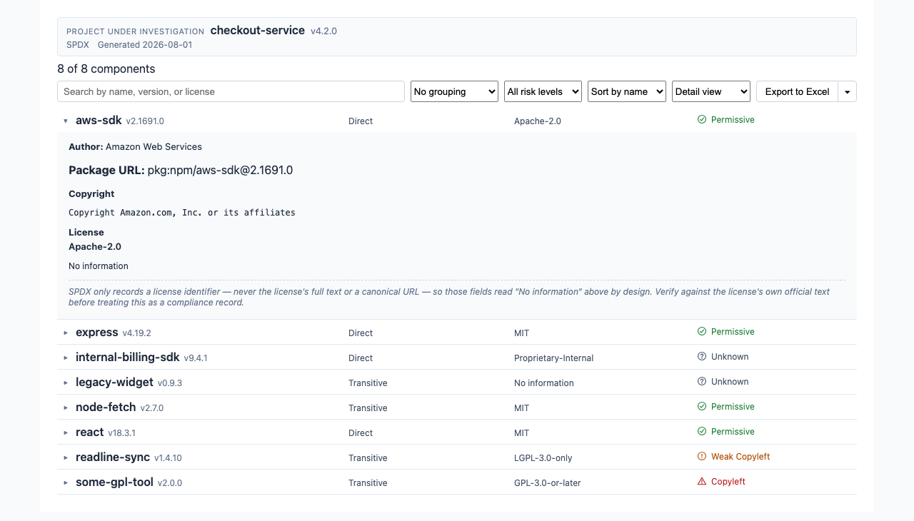
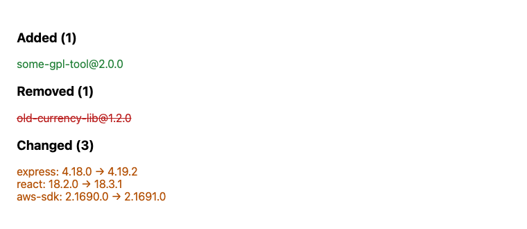
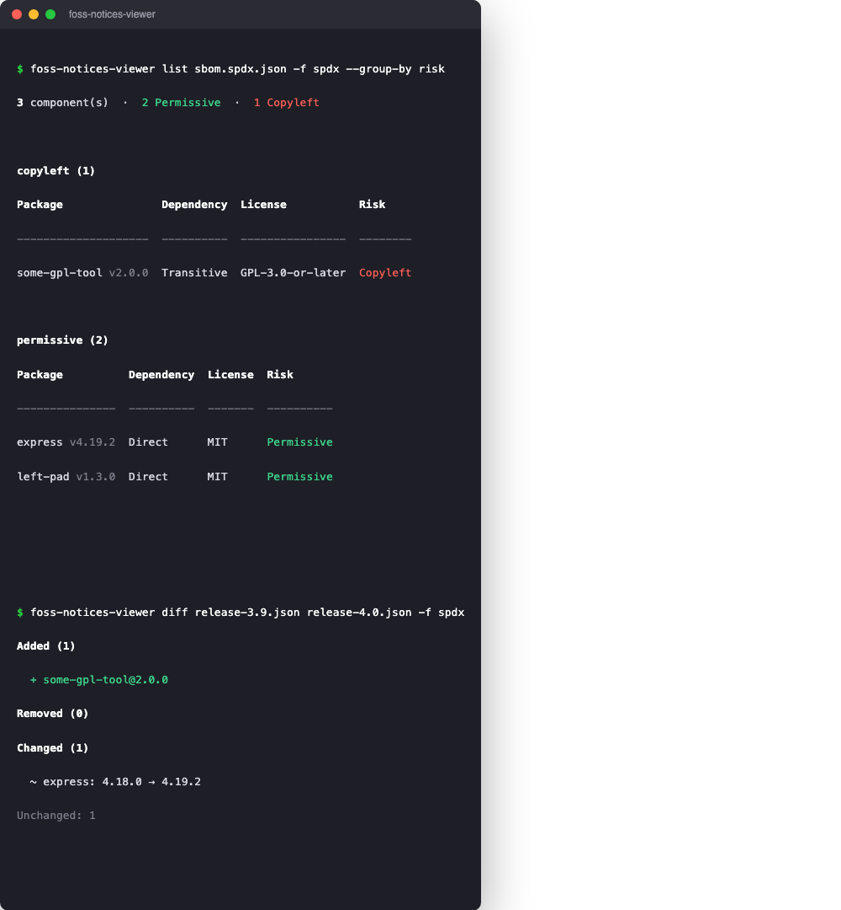

# foss-notices-viewer

Turn an SBOM or open-source notices file into a searchable, exportable license
viewer — as a React component, or a CLI for everything else.



## Why

License/SBOM tools (Black Duck, FOSSA, `syft`, `generate-license-file`,
`cyclonedx-npm`) export a notices *file*, not a UI. This package turns that
file into a normalized model and gives you a ready-made viewer for it — an
"About → Open Source Licenses" screen, an internal compliance dashboard, or a
CI check — so you don't have to build one from scratch.

## Install

```bash
npm install foss-notices-viewer react react-dom
```

Only need the [CLI](#cli)? Skip `react`/`react-dom`:

```bash
npm install -g foss-notices-viewer
```

## Supported formats

| Format | `adapter` id | Notes |
|---|---|---|
| SPDX 2.x JSON | `spdx` | e.g. `syft -o spdx-json`, most SCA tools' "export as SPDX" |
| CycloneDX 1.4/1.5 JSON | `cyclonedx` | e.g. `cyclonedx-npm`, `syft -o cyclonedx-json`, Black Duck's CycloneDX export |
| `generate-license-file` output | `generate-license-file` | plain-text output of the npm package of the same name |
| Black Duck Notices Report | `black-duck` | plain-text export (best-effort — see [Good to know](#good-to-know)) |

Not every field is available in every format — see the [field support
matrix](#field-support-by-format) below.

## Quick start

```tsx
import { NoticesViewer } from "foss-notices-viewer/react";
import "foss-notices-viewer/styles.css";

// Pass the raw file contents and the format — the viewer parses and validates it for you
<NoticesViewer adapter="spdx" document={spdxJsonString} />;
```

If you'd rather parse it yourself first (e.g. to inspect or transform the
data before rendering), the same parsers are available directly:

```ts
import { parseSpdxDocument } from "foss-notices-viewer";

const document = parseSpdxDocument(spdxJsonString);
```

```tsx
<NoticesViewer document={document} />
```

### `<NoticesViewer>` props

| Prop | Type | Default | What it does |
|---|---|---|---|
| `document` | `NoticesDocument \| string` | — | An already-parsed document, or raw file text when `adapter` is set |
| `adapter` | `"spdx" \| "cyclonedx" \| "generate-license-file" \| "black-duck"` | — | Parse and validate `document` (as raw text) for this format |
| `licenseRiskMap` | `{ [licenseId]: RiskTier }` | — | Override or extend the default [risk classification](#risk-classification) |
| `viewMode` | `"detail" \| "summary"` | `"detail"` | Starting view — `detail` expands rows on click, `summary` shows headers only |
| `onViewModeChange` | `(mode) => void` | — | Get notified when the built-in view toggle changes |
| `virtualized` | `boolean` | `true` | Virtualize the row list (recommended for large lists) |

Out of the box you get a search box, group-by (license or risk tier), sort,
pagination, expandable rows with full license text and copyright notices, and
an "Export to Excel" button.

### Other components

| Component | What it's for |
|---|---|
| `<NoticesFileUpload />` | A format picker + file upload flow that feeds straight into `<NoticesViewer>` |
| `<DiffView before after />` | Compare two releases — see [below](#compare-two-releases) |
| `<ValidationReportView report />` | Show validation errors/warnings — see [below](#validate-a-file) |
| `<ExportButton document />` / `<ExportValidationButton report />` | Standalone export buttons, if you're not using `<NoticesViewer>`'s built-in one |
| `<LicenseBadge>`, `<DependencyBadge>`, `<ProjectHeader>`, `<ComponentList>`, `<ComponentRow>` | Smaller building blocks, for a custom UI on the same data |
| `useNotices(document)` | Headless hook (search/group/sort/paginate state) for building your own UI |

## Compare two releases



```tsx
import { DiffView } from "foss-notices-viewer/react";

<DiffView before={previousReleaseNotices} after={currentReleaseNotices} />;
```

Flags components that were added, removed, or changed (version or license)
between two releases — useful as a compliance gate in CI or a pre-release
check.

## CLI

```bash
npm install -g foss-notices-viewer
foss-notices-viewer --help
```



Installed as both `foss-notices-viewer` and the shorter `fnv`.

| Command | What it does |
|---|---|
| `validate <file> -f <format>` | Check the file against the format's schema; exits non-zero on failure, so it doubles as a CI gate |
| `parse <file> -f <format>` | Convert to the normalized JSON model |
| `list <file> -f <format>` | Search, group, and filter, printed as a table |
| `report <file> -f <format> -o <path>` | Export to Excel or JSON |
| `diff <before> <after> -f <format>` | Compare two releases; `--fail-on-change` turns it into a CI gate |

| Common flag | Description |
|---|---|
| `-f, --format <format>` | `spdx`, `cyclonedx`, `generate-license-file`, or `black-duck` |
| `--risk-map <path>` | JSON file of `{ "License-Id": "risk-tier" }` overrides |
| `--json` | Print the raw data instead of a formatted table |
| `--no-color` | Disable colored output (auto-disabled when not writing to a terminal) |

Run `foss-notices-viewer <command> --help` for every command's full options.

## Export

`<NoticesViewer>` has a built-in "Export to Excel" button (with a menu for
JSON instead). Both export one row per component: name, version, license,
risk tier, author, and package URL.

To build the same file yourself — from a script, or your own button:

```ts
import { exportNoticesToExcel, exportNoticesToJson } from "foss-notices-viewer/export";
import { writeFileSync } from "node:fs";

writeFileSync("notices.xlsx", await exportNoticesToExcel(document));
writeFileSync("notices.json", exportNoticesToJson(document));
```

Or from the CLI:

```bash
foss-notices-viewer report sbom.spdx.json -f spdx -o notices.xlsx
```

## Validate a file

Parsing is deliberately lenient, so a file can "parse" successfully while
still being invalid against the format's actual spec. Validation checks the
whole file and reports every problem at once, with line numbers and a
suggested fix for each:

```ts
import { validateSpdxDocument } from "foss-notices-viewer/validation";

const report = validateSpdxDocument(spdxJsonString);
```

```tsx
import { ValidationReportView } from "foss-notices-viewer/react";

<ValidationReportView report={report} />;
```

Or from the CLI: `foss-notices-viewer validate sbom.spdx.json -f spdx`.

| Format | Checked against |
|---|---|
| SPDX | The official SPDX 2.3 JSON Schema |
| CycloneDX | The official CycloneDX 1.5 JSON Schema |
| `generate-license-file` | This package's own structural rules — no official schema exists for this format |
| Black Duck | This package's own structural rules — no official schema exists for this format |

## Risk classification

Every license is classified into a risk tier, using a built-in default map
that you can override per your own policy:

| Tier | Examples |
|---|---|
| Permissive | MIT, Apache-2.0, BSD |
| Weak copyleft | LGPL, MPL |
| Copyleft | GPL, AGPL |
| Proprietary | Whatever you map to it |
| Unknown | License couldn't be classified |

```tsx
<NoticesViewer document={document} licenseRiskMap={{ "Some-Internal-License-1.0": "proprietary" }} />
```

## Field support by format

Some fields depend on data the source format doesn't always carry:

| Field | SPDX | CycloneDX | `generate-license-file` | Black Duck |
|---|---|---|---|---|
| Author | ✓ | ✓ | – | – |
| Package URL | ✓ | ✓ | – | – |
| Direct / transitive | ✓ (if present in file) | ✓ (if present in file) | – | – |
| Project name / version | ✓ | ✓ | – | – |
| Generated date | ✓ | ✓ | – | – |
| License full text / URL | – | – | – | – |

Where a field isn't available, the viewer shows "No information" rather than
guessing.

## Try it live

A runnable playground lives in [`examples/`](./examples) — pick a format,
paste your own file, and see the viewer, diff, upload, and export flows in
action.

```bash
git clone <this-repo>
cd foss-notices-viewer/examples
npm install
npm run dev
```

## Good to know

- **Default risk map isn't legal advice.** It's a reasonable starting point —
  override it for your org's actual policy.
- **`generate-license-file`'s license id is a best-effort guess** from raw
  license text, since that format doesn't carry an id. Check anything it
  doesn't recognize.
- **Black Duck's report layout isn't a published standard** and varies by
  version. If a file doesn't parse cleanly, export SPDX or CycloneDX from
  Black Duck instead.
- **Schema validation checks structure, not legal correctness** — it won't
  catch a wrong-but-well-formed license id or a `purl` that doesn't resolve.
- **Excel/JSON export is a summary**, not the full record — it doesn't
  include license text or copyright notices.

## License

MIT
